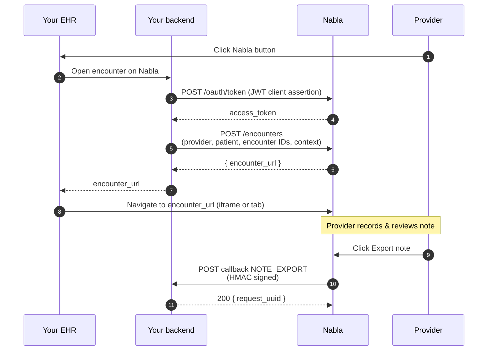

A Nabla Connect integration involves two halves: a **launch flow** (your EHR opens an encounter on Nabla) and an **export flow** (Nabla sends the resulting note back to your EHR). This page explains how they fit together at the user level and at the API level.

## High-level diagram

## What the provider sees

1. **Click** the Nabla button in your EHR's encounter screen.
2. **Nabla opens** — as an iframe or in an external browser tab, depending on your integration — on the encounter that's just been auto-created on Nabla's side.
3. **Classic Nabla flow** — the provider records the visit, generates a note, and reviews or edits it using Nabla tools. The note generation is grounded by the context your EHR passed in.
4. **Export** — the provider clicks **Export note** (which replaces Nabla's default **Copy note** button), and the note plus visit diagnoses are sent back to your EHR.

## What your servers do

The flow above maps onto a handful of API calls:

The `encounter_url` returned by Nabla is one-time use and expires after **10 minutes** — see [Launch an encounter](/connect/guides/launch-an-encounter) for how to refresh it without losing the encounter.

## Two API directions

The rest of the documentation is organised around these two directions.

- **Server API (EHR → Nabla)** — endpoints your backend calls. Authentication is OAuth 2.0 with a JWT client assertion. See the full surface in [API reference → Server API](/connect/reference/server-api/create-encounter).
- **Callbacks (Nabla → EHR)** — requests Nabla sends to your single configured webhook URL. Each request is signed with HMAC-SHA256. See [API reference → Callbacks](/connect/reference/callbacks/overview).

If you're unsure which side a feature belongs to, the [Incoming vs outgoing APIs](/connect/concepts/incoming-vs-outgoing-apis) page lays out the split with examples.

## Next steps

<Columns cols={2}>
  <Card title="Incoming vs outgoing APIs" icon="arrows-left-right" href="/connect/concepts/incoming-vs-outgoing-apis">
    A short mental model for the two directions of traffic.
  </Card>
  <Card title="Launch an encounter" icon="rocket" href="/connect/guides/launch-an-encounter">
    Walk through the `POST /encounters` call end-to-end.
  </Card>
</Columns>
