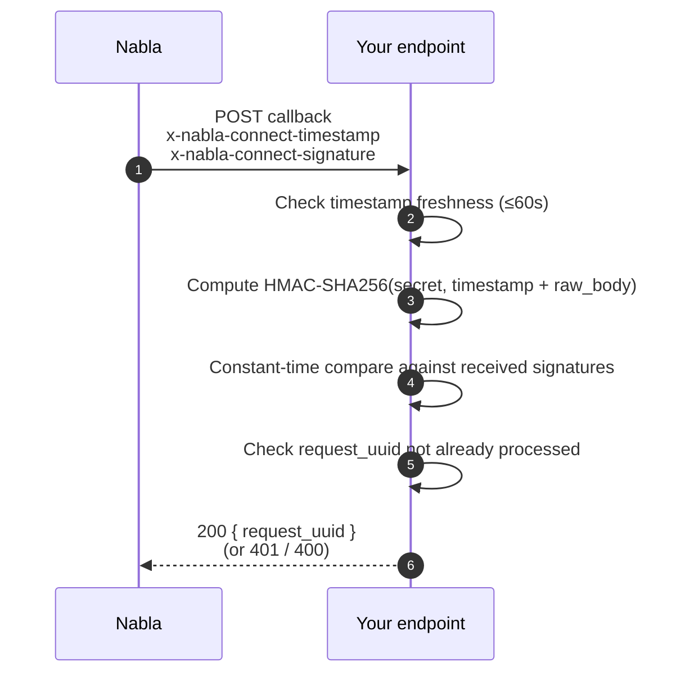

**What you'll build.** A single catch-all HTTPS endpoint on your backend that receives every Nabla Connect callback (note exports, patient instructions exports, and future types), verifies the HMAC-SHA256 signature, and acknowledges the request by echoing back its `request_uuid`.

**Prerequisites.**

- Access to the [Nabla Connect Admin](https://app.nabla.com/admin/nabla-connect) to register the URL and retrieve the signature secret.
- A publicly reachable HTTPS endpoint (TLS is required — plain HTTP is rejected).
- A persistent store you can use for idempotency keys (database, Redis, etc.).

## The end-to-end flow

Nabla Connect uses one endpoint for every callback type. The `type` field on the envelope tells your handler which payload shape to expect — see the [callback envelope reference](/connect/reference/callbacks/overview).



## 1. Expose a single catch-all endpoint

Your endpoint must:

- Accept `POST` over HTTPS at a fixed path (for example `POST /webhooks/nabla-connect`).
- Read the **raw** request body before any JSON parsing — the HMAC is computed over the exact bytes Nabla sent.
- Handle every callback `type`, dispatching on the envelope `type` field. New types may be added in the future; reject unknown ones with `400`.
- Acknowledge fast. Slow responses surface an error to the provider in the Nabla app — see [Callback latency](/connect/best-practices/callback-latency).

## 2. Register the URL in the Admin

In the [Nabla Connect Admin](https://app.nabla.com/admin/nabla-connect), set the callback URL to the public HTTPS endpoint you exposed above. Then copy the **signature secret** — you'll use it to verify every incoming request. Store it as an environment variable; never check it into source control.

## 3. Verify the signature on every request

Every callback includes two authentication headers:

- `x-nabla-connect-timestamp` — ISO 8601 timestamp of when Nabla generated the request.
- `x-nabla-connect-signature` — one or more HMAC-SHA256 signatures (comma-separated during a key rotation window).

Each signature is `HMAC-SHA256(secret, timestamp + raw_body)`, hex-encoded. Your handler must:

1. Extract both headers.
2. Reject the request if the timestamp is older than 60 seconds (replay protection).
3. Compute `HMAC-SHA256(secret, timestamp + raw_body)` using the secret from the Admin.
4. Compare it against every received signature using a **constant-time** compare. Reject with `401` if none match.
5. Check that `request_uuid` hasn't been processed before. If it has, respond `200` with the same body — Nabla may retry. See [Idempotency](/connect/best-practices/idempotency).
6. Dispatch on `type`, persist the payload, and respond `200 { "request_uuid": "..." }`.

<Tabs>
<Tab title="cURL">

You can replay a captured callback locally to test your verification code. Replace the values with the ones from a real request you logged.

```bash
TIMESTAMP="2026-05-12T09:41:00Z"
SECRET="<SIGNATURE_SECRET>"
BODY='{"request_uuid":"4f1a...","type":"NOTE_EXPORT","data":{}}'

SIGNATURE=$(printf "%s%s" "$TIMESTAMP" "$BODY" \
  | openssl dgst -sha256 -hmac "$SECRET" -hex \
  | awk '{print $2}')

curl -X POST https://your-backend.example.com/webhooks/nabla-connect \
  -H "Content-Type: application/json" \
  -H "x-nabla-connect-timestamp: $TIMESTAMP" \
  -H "x-nabla-connect-signature: $SIGNATURE" \
  --data "$BODY"
```

</Tab>
<Tab title="Node">

```js
const bodyParser = require("body-parser");
const crypto = require("crypto");
const express = require("express");

const app = express();
const SIGNATURE_SECRET = process.env.NABLA_CONNECT_SIGNATURE_SECRET;
const seenRequestUuids = new Set(); // replace with a durable store in production

app.use(
  bodyParser.json({
    type: "application/json",
    verify(req, _res, buf) {
      const timestamp = req.headers["x-nabla-connect-timestamp"];
      const received = (req.headers["x-nabla-connect-signature"] || "").split(",");

      if (!timestamp || Date.now() - Date.parse(timestamp) > 60_000) {
        throw new Error("Timestamp missing or too old");
      }

      const computed = crypto
        .createHmac("sha256", SIGNATURE_SECRET)
        .update(timestamp + buf.toString())
        .digest("hex");

      const computedBuf = Buffer.from(computed, "hex");
      const match = received.some((sig) => {
        const sigBuf = Buffer.from(sig.trim(), "hex");
        return (
          sigBuf.length === computedBuf.length &&
          crypto.timingSafeEqual(sigBuf, computedBuf)
        );
      });
      if (!match) throw new Error("Signature mismatch");
    },
  })
);

app.post("/webhooks/nabla-connect", (req, res) => {
  const { request_uuid, type } = req.body;

  if (seenRequestUuids.has(request_uuid)) {
    return res.status(200).json({ request_uuid });
  }
  seenRequestUuids.add(request_uuid);

  switch (type) {
    case "NOTE_EXPORT":
      // ... persist req.body.data.note, visit_diagnoses, transcript ...
      break;
    case "PATIENT_INSTRUCTIONS_EXPORT":
      // ... persist req.body.data.patient_instructions ...
      break;
    default:
      return res.status(400).json({ error: "unknown_type" });
  }

  res.status(200).json({ request_uuid });
});

// Express converts thrown errors in body-parser verify() into 401 here.
app.use((err, _req, res, _next) => {
  res.status(401).json({ error: err.message });
});
```

</Tab>
<Tab title="Python">

```python
import hmac
import hashlib
import os
from datetime import datetime, timezone
from flask import Flask, request, abort, jsonify

app = Flask(__name__)
SIGNATURE_SECRET = os.environ["NABLA_CONNECT_SIGNATURE_SECRET"].encode()
seen_request_uuids = set()  # replace with durable storage in production


@app.post("/webhooks/nabla-connect")
def receive():
    timestamp = request.headers.get("x-nabla-connect-timestamp", "")
    received = request.headers.get("x-nabla-connect-signature", "").split(",")
    raw_body = request.get_data()

    try:
        sent_at = datetime.fromisoformat(timestamp.replace("Z", "+00:00"))
    except ValueError:
        abort(401)
    if (datetime.now(timezone.utc) - sent_at).total_seconds() > 60:
        abort(401)

    computed = hmac.new(
        SIGNATURE_SECRET,
        (timestamp + raw_body.decode()).encode(),
        hashlib.sha256,
    ).hexdigest()

    if not any(hmac.compare_digest(sig.strip(), computed) for sig in received):
        abort(401)

    payload = request.get_json()
    request_uuid = payload["request_uuid"]
    callback_type = payload["type"]

    if request_uuid in seen_request_uuids:
        return jsonify(request_uuid=request_uuid), 200
    seen_request_uuids.add(request_uuid)

    if callback_type == "NOTE_EXPORT":
        # ... persist payload["data"]["note"], visit_diagnoses, transcript ...
        pass
    elif callback_type == "PATIENT_INSTRUCTIONS_EXPORT":
        # ... persist payload["data"]["patient_instructions"] ...
        pass
    else:
        return jsonify(error="unknown_type"), 400

    return jsonify(request_uuid=request_uuid), 200
```

</Tab>
</Tabs>

<Warning>
Always use a **constant-time** compare (`crypto.timingSafeEqual` in Node, `hmac.compare_digest` in Python). A naïve `==` check leaks timing information that an attacker can use to forge signatures.
</Warning>

For the full envelope shape and status-code semantics, see the [callback envelope reference](/connect/reference/callbacks/overview). For more details on HMAC-SHA256 see [RFC-2104](https://datatracker.ietf.org/doc/html/rfc2104) and [RFC-4231](https://datatracker.ietf.org/doc/html/rfc4231).

## 4. Acknowledge with `200 { request_uuid }`

For every recognized callback, respond `200` with a JSON body that echoes the `request_uuid`:

```json
{ "request_uuid": "4f1a8e16-2c0e-4e63-9c0e-7ac6f6e7c1f0" }
```

Nabla awaits this response before showing a success message to the provider. Slow or failing responses surface an error in the app — keep the synchronous path fast and defer heavy work (EHR write, indexing, notification) to a background queue.

## Next steps

<Columns cols={2}>
  <Card title="Export notes" icon="file-export" href="/connect/guides/export-notes">
    Map `NOTE_EXPORT` and `PATIENT_INSTRUCTIONS_EXPORT` payloads into your EHR.
  </Card>
  <Card title="Callback envelope reference" icon="code" href="/connect/reference/callbacks/overview">
    Headers, envelope shape, response codes, and HMAC recipe.
  </Card>
  <Card title="Idempotency" icon="rotate-right" href="/connect/best-practices/idempotency">
    Make your handler safe under retry by deduplicating on `request_uuid`.
  </Card>
  <Card title="Callback latency" icon="gauge-high" href="/connect/best-practices/callback-latency">
    Why you should respond fast and how to defer heavy work.
  </Card>
</Columns>
