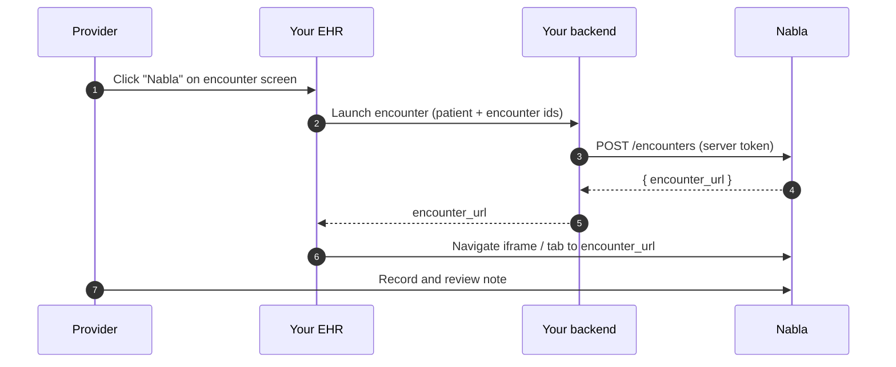

**What you'll build.** A Nabla button in your EHR encounter screen that, on click, mints a one-time URL and navigates the provider into a Nabla encounter pre-populated with the current patient and visit context.

**Prerequisites.**

- An OAuth client created in the [Nabla Connect Admin](https://app.nabla.com/admin/nabla-connect).
- A server access token. See [Authentication](/connect/authentication).
- A slot in your EHR encounter screen for the Nabla button (and, if you embed via iframe, a container with `allow="microphone;"` — see [Iframe embedding](/connect/concepts/iframe-embedding)).

## The end-to-end flow

When the provider clicks the Nabla button:

1. Your frontend asks your backend to launch a Nabla encounter.
2. Your backend calls `POST /encounters` with the patient, provider, and encounter identifiers plus any structured or unstructured context.
3. Nabla matches (or lazily provisions) the provider, creates the encounter, and returns a one-time `encounter_url`.
4. Your backend hands `encounter_url` to your frontend.
5. Your frontend navigates to that URL — either by setting it as the `src` of an iframe or by opening a new tab. The provider is logged in automatically and lands on the encounter.



## 1. Mint a server access token

Reuse the token you cached from the OAuth client credentials flow. If you don't have one yet, follow [Authentication](/connect/authentication) — it walks through building the JWT assertion and exchanging it at `POST /oauth/token`.

<Tip>
Cache the access token and reuse it across requests. Trust `expires_in` from the token response; don't mint a new one per encounter launch.
</Tip>

## 2. Call `POST /encounters`

From your backend, post the patient, provider, and encounter identifiers along with the context you want Nabla to use when generating the note. The example below includes all the optional fields available in the current `2026-04-24` version: `unstructured_context` and `structured_context.visit_diagnoses`.

<Tabs>
<Tab title="cURL">

```bash
curl -X POST https://us.api.nabla.com/v1/connect/server/encounters \
  -H "Authorization: Bearer $ACCESS_TOKEN" \
  -H "X-Nabla-Api-Version: 2026-04-24" \
  -H "Content-Type: application/json" \
  -d '{
    "provider_email": "dr.smith@example-clinic.com",
    "external_provider_id": "prov_8421",
    "external_patient_id": "pat_55102",
    "external_encounter_id": "enc_2026_05_12_001",
    "structured_context": {
      "patient_demographics": {
        "name": "Jane Doe",
        "birth_date": "1982-07-14",
        "gender": "female",
        "pronouns": "she/her"
      },
      "visit_diagnoses": [
        {
          "system": "http://hl7.org/fhir/sid/icd-10-cm",
          "code": "E11.9",
          "display": "Type 2 diabetes mellitus without complications"
        }
      ]
    },
    "unstructured_context": "Annual follow-up for type 2 diabetes. Patient reports improved adherence to metformin."
  }'
```

</Tab>
<Tab title="Node">

```js
const res = await fetch("https://us.api.nabla.com/v1/connect/server/encounters", {
  method: "POST",
  headers: {
    Authorization: `Bearer ${access_token}`,
    "X-Nabla-Api-Version": "2026-04-24",
    "Content-Type": "application/json",
  },
  body: JSON.stringify({
    provider_email: "dr.smith@example-clinic.com",
    external_provider_id: "prov_8421",
    external_patient_id: "pat_55102",
    external_encounter_id: "enc_2026_05_12_001",
    structured_context: {
      patient_demographics: {
        name: "Jane Doe",
        birth_date: "1982-07-14",
        gender: "female",
        pronouns: "she/her",
      },
      visit_diagnoses: [
        {
          system: "http://hl7.org/fhir/sid/icd-10-cm",
          code: "E11.9",
          display: "Type 2 diabetes mellitus without complications",
        },
      ],
    },
    unstructured_context:
      "Annual follow-up for type 2 diabetes. Patient reports improved adherence to metformin.",
  }),
});

const { encounter_url } = await res.json();
```

</Tab>
<Tab title="Python">

```python
import requests

resp = requests.post(
    "https://us.api.nabla.com/v1/connect/server/encounters",
    headers={
        "Authorization": f"Bearer {access_token}",
        "X-Nabla-Api-Version": "2026-04-24",
        "Content-Type": "application/json",
    },
    json={
        "provider_email": "dr.smith@example-clinic.com",
        "external_provider_id": "prov_8421",
        "external_patient_id": "pat_55102",
        "external_encounter_id": "enc_2026_05_12_001",
        "structured_context": {
            "patient_demographics": {
                "name": "Jane Doe",
                "birth_date": "1982-07-14",
                "gender": "female",
                "pronouns": "she/her",
            },
            "visit_diagnoses": [
                {
                    "system": "http://hl7.org/fhir/sid/icd-10-cm",
                    "code": "E11.9",
                    "display": "Type 2 diabetes mellitus without complications",
                }
            ],
        },
        "unstructured_context": (
            "Annual follow-up for type 2 diabetes. "
            "Patient reports improved adherence to metformin."
        ),
    },
).json()

encounter_url = resp["encounter_url"]
```

</Tab>
</Tabs>

The response is a single field:

```json
{ "encounter_url": "https://app.nabla.com/connect/launch/<one-time-token>" }
```

For the full payload schema, field-level requirements, and the `visit_diagnoses` shape, see the [`POST /encounters` reference](/connect/reference/server-api/create-encounter).

<Info>
If no Nabla user exists for the given `external_provider_id`, Nabla provisions one lazily using `provider_email`. If a user already exists for that `external_provider_id` but with a different email, the request fails. To set richer provider settings (specialty, dictation locales) **before** the first encounter, call `POST /users` first — see [Provision users](/connect/guides/provision-users).
</Info>

## 3. Navigate to `encounter_url`

Hand the URL to your frontend and navigate the provider into it. Either approach works:

- **Iframe**: set `encounter_url` as the `src` of an iframe with `allow="microphone;"`. See [Iframe embedding](/connect/concepts/iframe-embedding) for sizing and permission policy.
- **New tab**: `window.open(encounter_url, "_blank")`.

<Warning>
`encounter_url` is **one-time use** and expires **10 minutes** after creation. Don't cache it, don't store it in your database, and don't pass it through long-lived queues. If you need a fresh URL for the same encounter (e.g., the provider closed the tab), call [`POST /encounters/url`](/connect/reference/server-api/refresh-encounter-url) with the same `external_provider_id` and `external_encounter_id`.
</Warning>

## 4. (Optional) Pin the API version

Add `X-Nabla-Api-Version: 2026-04-24` to every Connect request so future versions don't change the response shape under your integration. See [Targeting a specific version](/connect/api-versioning/targeting-a-version).

## Next steps

<Columns cols={2}>
  <Card title="POST /encounters reference" icon="code" href="/connect/reference/server-api/create-encounter">
    Full payload schema, field requirements, and behavior notes.
  </Card>
  <Card title="Handle callbacks" icon="webhook" href="/connect/guides/handle-callbacks">
    Receive the exported note (and visit diagnoses) on a signed callback.
  </Card>
  <Card title="Provision users" icon="user-plus" href="/connect/guides/provision-users">
    Pre-configure a provider's specialty and dictation locales before launch.
  </Card>
  <Card title="Iframe embedding" icon="window" href="/connect/concepts/iframe-embedding">
    Wire `encounter_url` into an iframe with the right permission policy.
  </Card>
</Columns>
