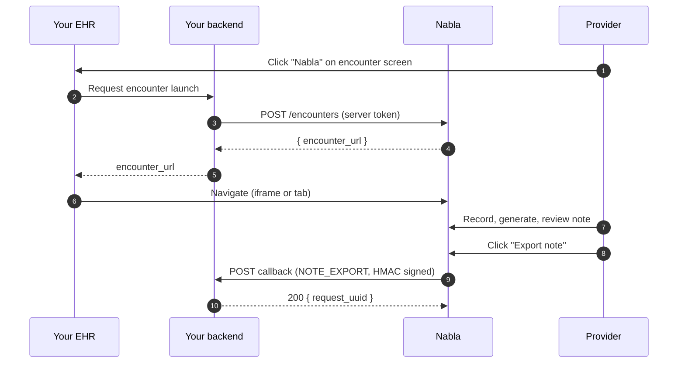

Nabla Connect is an integration protocol between Nabla and any EHR, leveraging API calls between Nabla's server and your EHR's server. It lets healthcare providers launch a Nabla encounter directly from the EHR, with patient context flowing in automatically and the generated note flowing back out — no copy-pasting.

<Tip>
**New here?** Read the [Flow overview](/connect/concepts/flow-overview) for the high-level diagram, then walk through the [Quickstart](/connect/quickstart) to wire up an end-to-end encounter in under an hour.
</Tip>

## What it does

- **Integrated encounter creation** — A button in your EHR launches a Nabla encounter pre-linked to the current patient and encounter.
- **Contextual data sharing** — Nabla receives patient context: name, age, gender, visit diagnoses, and any unstructured notes you choose to pass.
- **Simplified note export** — Providers click **Export note** and the generated note, visit diagnoses, and patient instructions are sent back to your EHR over a signed callback.

<Info>
Contact [connect@nabla.com](mailto:connect@nabla.com) to create your organization on Nabla Connect.
</Info>

## How it works

1. The provider clicks the Nabla button on your EHR's encounter screen.
2. Nabla opens (iframe or browser tab) on an encounter that's been auto-created with the EHR context.
3. The provider records, generates, and reviews the note using Nabla tools.
4. The provider clicks **Export note** — Nabla calls your backend with the structured note and any associated data.

## Two API directions

Nabla Connect is built around two opposite flows. They're the spine of the rest of these docs.

- **Server API (EHR → Nabla)** — Your backend calls Nabla to create or refresh an encounter and to upsert provider users. Authenticated with OAuth 2.0 client credentials. See [Launch an encounter](/connect/guides/launch-an-encounter).
- **Callbacks (Nabla → EHR)** — Nabla calls your backend when the provider exports a note or patient instructions. Authenticated with HMAC-SHA256 request signatures. See [Handle callbacks](/connect/guides/handle-callbacks).

## Integration checklist

Use this as the rough sequence for shipping a Connect integration. Each item links to the page that walks through the details.

- [ ] Create an OAuth client and implement [authentication](/connect/authentication).
- [ ] Add a Nabla button on your EHR's encounter screen that triggers `POST /encounters` from your backend — see [Launch an encounter](/connect/guides/launch-an-encounter).
- [ ] If embedding via iframe, add `allow="microphone;"` — see [Iframe embedding](/connect/concepts/iframe-embedding).
- [ ] Expose a single catch-all webhook endpoint and configure its URL in the [Nabla Connect Admin](https://app.nabla.com/admin/nabla-connect).
- [ ] Implement [HMAC signature verification](/connect/guides/handle-callbacks) on every incoming callback.
- [ ] Handle `NOTE_EXPORT` and `PATIENT_INSTRUCTIONS_EXPORT` callback types — see [Export notes](/connect/guides/export-notes).

## Next steps

<Columns cols={2}>
  <Card title="Quickstart" icon="bolt" href="/connect/quickstart">
    Make your first end-to-end encounter in under an hour.
  </Card>
  <Card title="Flow overview" icon="diagram-project" href="/connect/concepts/flow-overview">
    The high-level diagram and the user-side flow.
  </Card>
  <Card title="Authentication" icon="key" href="/connect/authentication">
    Set up an OAuth client and request server access tokens.
  </Card>
  <Card title="API reference" icon="code" href="/connect/reference/server-api/create-encounter">
    Endpoint and callback payload schemas.
  </Card>
</Columns>
