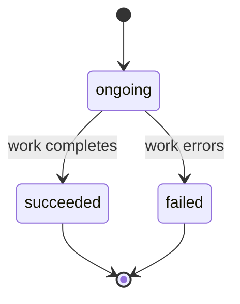

Asynchronous note generation provides a seamless alternative to our standard note generation process, which typically takes a few seconds to complete.
By utilizing this asynchronous endpoint, users can initiate a note generation request and receive an immediate response containing a unique request ID.
This allows users to continue other tasks or quit the app while the note is being generated.

Once you have the request ID, you can poll the status of your note generation at your convenience.
This polling mechanism enables you to check whether the generation was successful or if it encountered any errors, along with retrieving the generated note payload once it is available.

This approach optimizes the workflow, enhances user experience, and ensures that your application remains responsive while processing note generation tasks.

Please note that the payload for successful requests is retained for two hours before being removed to ensure privacy.
This value can potentially be overridden by your organization's settings, so please [reach out](mailto:api@nabla.com) for more details and further customization.

<Tip>
Asynchronous note generations created by a given user can only be accessed by the **same** user (through the User API) or **by the organisation's server** (through the Server API).

Thus, when a user creates an asynchronous note generation, they can provide the request ID to their servers in case they want to poll the response on their behalf.
</Tip>

## State machine



Every async request starts at `ongoing` and transitions exactly once to either `succeeded` (with a `payload`) or `failed` (with an error `code`).

## Example asynchronous note generation

You can create an asynchronous note generation that will start executing immediately (`status = ongoing`).
Then, you can regularly poll the asynchronous note generation to check for its status.
Once `status = succeeded` a payload will be provided as part of the asynchronous note generation poll response.
The payload contains the generated note and the suggested Dot Phrases.

### Create the asynchronous note generation

POST `https://us.api.nabla.com/v1/core/user/generate-note-async` immediately returns:

```json
{
  "id": "94cf4b36-7c82-4c80-a9d4-485dff2da309",
  "client_request_id": "example-number-42",
  "status": "ongoing"
}
```

### Poll its status and results

Regularly check for updates to the created asynchronous note generation by calling `/generate-note-async/<ASYNC-NOTE-GEN-ID>`

```json
{
  "id": "94cf4b36-7c82-4c80-a9d4-485dff2da309",
  "client_request_id": "example-number-42",
  "status": "succeeded",
  "payload": {
    "note": {
      "title": "Mrs Abbott - Feeling tired and unable to focus at work",
      "sections": [
        {
          "key": "CHIEF_COMPLAINT",
          "title": "Chief complaint",
          "text": "Feeling tired all day, difficulty focusing at work, desire to rest, onset 4 months ago"
        },
        {
          "key": "HISTORY_OF_PRESENT_ILLNESS",
          "title": "History of present illness",
          "text": "Name of the patient: Mrs Abbott\n\nGeneral fatigue\n- Started feeling tired all day long 4 months ago, in April\n- Difficulty focusing at work due to fatigue\n- No mention of any alleviating or aggravating factors\n- No mention of any triggers or circumstances during which fatigue occurs\n- No mention of any recurrence or abatement dates\n\nHeadaches\n- Experiencing headaches at the end of the day\n- No mention of any alleviating or aggravating factors\n- No mention of any triggers or circumstances during which headaches occur\n- No mention of any recurrence or abatement dates\n\nMisc:\n- No fever\n- Allergic to peanuts and penicillin (not related to current symptoms)"
        },
        {
          "key": "ALLERGIES",
          "title": "Allergies",
          "text": "- Allergic to peanuts\n- History of penicillin allergy"
        },
        {
          "key": "VITALS",
          "title": "Vitals",
          "text": "Normal body temperature"
        },
        {
          "key": "PHYSICAL_EXAM",
          "title": "Physical exam",
          "text": "HEENT: Reports of headaches at the end of the day."
        }
      ]
    },
    "suggested_dot_phrases": []
  }
}
```

### Receive the response through webhooks

You can also configure your servers to receive the results of successful note generation (or the error details in case of failure) through a webhook integration.

Check the [Setup webhooks](/core-api/webhooks/setup) guide for more details on registering an endpoint and verifying signatures, and the [Webhooks overview](/core-api/webhooks/overview) for the full event catalog.

## Polling with backoff

If you can't (or don't want to) configure webhooks, poll with exponential backoff rather than a tight loop. Most note generations complete within a few seconds; a back-off pattern starting at 500 ms and capping around 5 seconds is a good default:

<Tabs>
<Tab title="Node">

```js
async function awaitAsyncNote(id, accessToken) {
  let delay = 500;
  for (;;) {
    const res = await fetch(`https://us.api.nabla.com/v1/core/server/generate-note-async/${id}`, {
      headers: { authorization: `Bearer ${accessToken}` },
    });
    const body = await res.json();

    if (body.status === "succeeded") return body.payload;
    if (body.status === "failed") throw new Error(`failed: ${body.error?.code}`);

    await new Promise((r) => setTimeout(r, delay));
    delay = Math.min(delay * 1.5, 5000);
  }
}
```

</Tab>
<Tab title="Python">

```python
import time
import requests

def await_async_note(req_id, access_token):
    delay = 0.5
    while True:
        resp = requests.get(
            f"https://us.api.nabla.com/v1/core/server/generate-note-async/{req_id}",
            headers={"authorization": f"Bearer {access_token}"},
        ).json()

        if resp["status"] == "succeeded":
            return resp["payload"]
        if resp["status"] == "failed":
            raise RuntimeError(f"failed: {resp.get('error', {}).get('code')}")

        time.sleep(delay)
        delay = min(delay * 1.5, 5.0)
```

</Tab>
</Tabs>

For high-throughput integrations, prefer webhooks — they remove polling traffic and reduce rate-limit pressure. See [Rate limits & quotas](/core-api/best-practices/rate-limits).

## Next steps

<Columns cols={2}>
  <Card title="Webhooks overview" icon="webhook" href="/core-api/webhooks/overview">
    Receive results without polling.
  </Card>
  <Card title="Retries & idempotency" icon="rotate-right" href="/core-api/webhooks/retries">
    Handle duplicate webhook deliveries safely.
  </Card>
</Columns>
