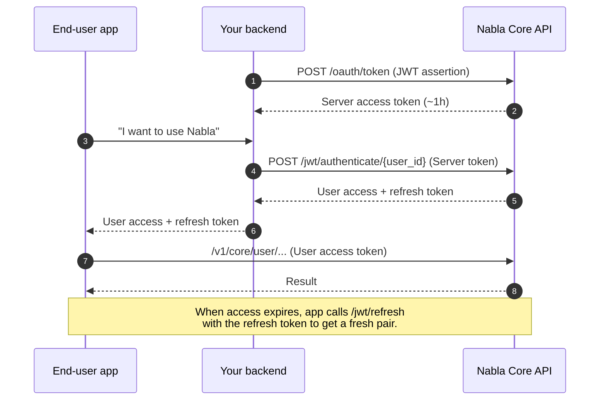

The Core API is split into two surfaces: the **Server API** and the **User API**. They expose largely the same capabilities but with different authentication, different token lifetimes, and different opinions about where calls originate.

## At a glance

| | Server API | User API |
|---|---|---|
| Caller | Your backend | A logged-in user's frontend or mobile client |
| Auth | OAuth 2.0 client credentials (JWT bearer assertion) | Per-user access + refresh tokens, issued by your backend via the Server API |
| Token TTL | ~1 hour | ~1 hour (access), longer-lived refresh |
| Base path | `/v1/core/server/...` | `/v1/core/user/...` |
| Who can read user-scoped data (e.g., Dot Phrases, note settings) | Yes, scoped via `user_id` | Yes, scoped automatically to the authenticated user |
| Where the secret lives | On your servers only | On your servers (you mint per-user tokens); never expose the OAuth Client private key to clients |

## When to use which

**Use the Server API** when:

- The call originates from your backend (cron job, webhook handler, batch processing).
- You're provisioning users, rotating tokens, or doing anything administrative.
- You're integrating with your own EHR-side backend that already authenticates users via your own session system.

**Use the User API** when:

- The call originates from a browser, mobile app, or desktop client that the end user has signed into.
- You want per-user accountability, per-user Dot Phrases, per-user note preferences, and per-user customizations to apply automatically.
- You want to avoid funnelling all user audio through your backend.

If you're building both, your backend will typically call the Server API to mint a User access token (via `POST /jwt/authenticate/{user_id}`), pass it to the client, and let the client call the User API directly thereafter.

## Token flow

## Common pitfalls

- **Don't ship the OAuth Client private key to clients.** Only the User access + refresh tokens may live on the client.
- **Don't share a single User token across users.** Each end user must have their own token pair so Dot Phrases, custom dictionaries, and audit trails attribute correctly.
- **Don't call Server endpoints from the browser.** The Server access token must stay on the backend.

## Next steps

<Columns cols={2}>
  <Card title="Authentication" icon="key" href="/core-api/authentication">
    Step-by-step setup for both flows, with code samples and a troubleshooting table.
  </Card>
  <Card title="Sync, async & streaming" icon="diagram-project" href="/core-api/concepts/sync-async-streaming">
    Pick the right execution model for each capability.
  </Card>
</Columns>
