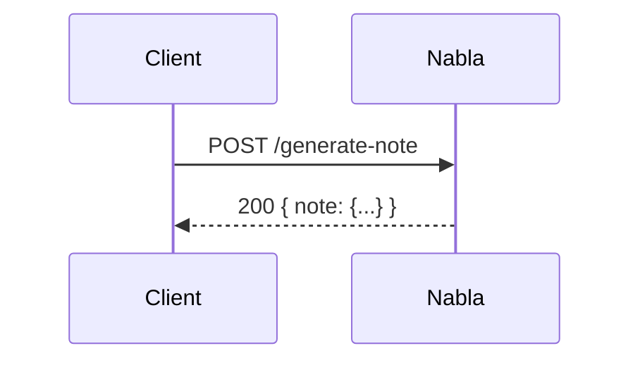
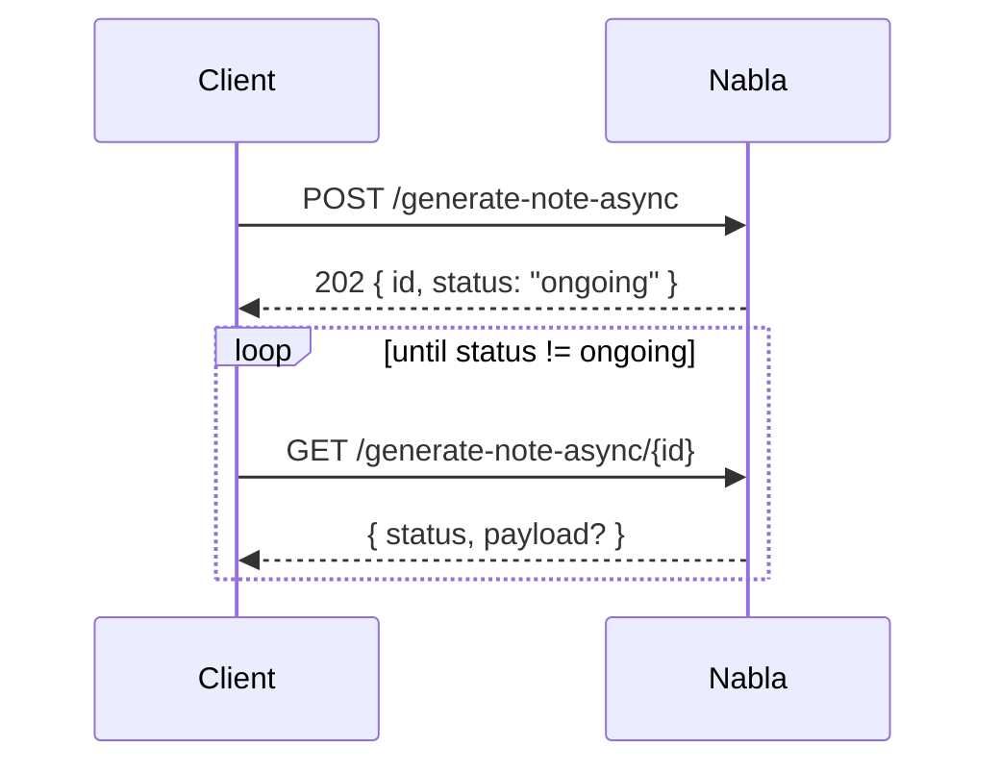
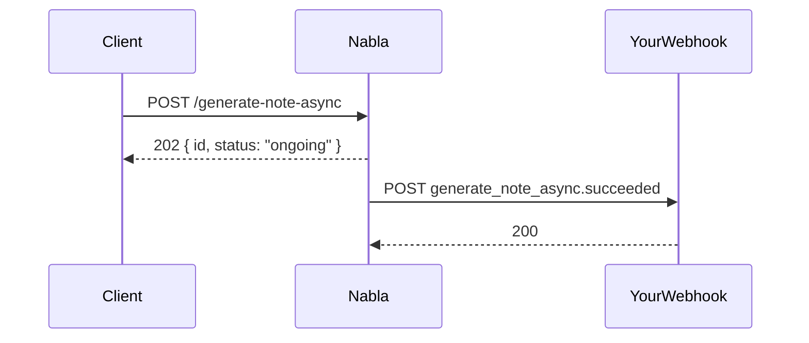
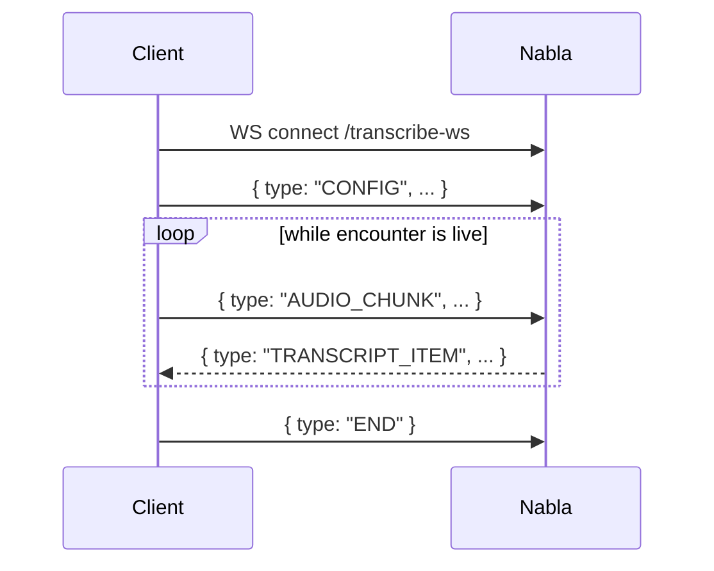

Most Core API capabilities are exposed in two or three flavours: a synchronous REST call, an asynchronous REST call with a polling/webhook result, and a WebSocket stream. Picking the right one is mostly a question of latency and audio length.

## Quick decision table

| Workflow | Best fit | Why |
|---|---|---|
| Live encounter, transcript needed as the conversation unfolds | **WebSocket** (`/transcribe-ws`, `/dictate`) | Sub-second latency; supports diarization mid-stream. |
| Recorded audio ≤ 10 minutes, you can wait a few seconds | **Sync REST** (`/transcribe`, `/generate-note`) | Simplest to integrate; one request, one response. |
| Recorded audio > 10 minutes (up to 60 min) | **Async REST** (`/transcribe-async`, `/generate-note-async`) | Avoids long-held HTTP connections; result delivered via polling or webhook. |
| Note generation behind a slow user interaction (e.g., a mobile background task) | **Async REST** | Lets the client disconnect and resume later. |
| High-throughput batch processing | **Async REST + webhooks** | Removes the polling cost; lets you scale workers based on event volume. |

## Sync REST

The caller issues a single HTTP request and waits for the full result. Typical latency: a few seconds for transcription, a few seconds for note generation.

Pros: trivial to integrate, no polling, no webhook setup.
Cons: the HTTP connection is held open; you can't disconnect; long inputs aren't supported.

## Async REST (polling)

The caller issues a request and immediately receives a request ID. The work continues server-side. The caller polls for status until the result is ready.

Pros: caller can disconnect; supports long inputs.
Cons: you write polling logic.

See [Async note generation](/core-api/best-practices/async-note-generation) for a concrete polling loop with backoff.

## Async REST (webhooks)

Same start, but instead of polling, Nabla posts to your registered webhook endpoint when the work finishes.

Pros: no polling, lowest tail latency, scales to high throughput.
Cons: you need a publicly reachable HTTPS endpoint and signature verification. See [Webhooks](/core-api/webhooks/overview).

## WebSocket streaming

The client opens a WebSocket, sends a `CONFIG` frame, then streams audio chunks. The server pushes back `TRANSCRIPT_ITEM` frames (and, for dictation, `DICTATED_TEXT` frames) in real time.

Pros: lowest latency; the only mode for real-time UX.
Cons: more state to manage (reconnects, buffering). See [Transcription network resilience](/core-api/best-practices/transcription-network-resilience) for the production-ready pattern.

## Next steps

<Columns cols={2}>
  <Card title="Stream a live encounter" icon="microphone" href="/core-api/guides/stream-a-live-encounter">
    A WebSocket walkthrough end-to-end.
  </Card>
  <Card title="Async note generation" icon="clock" href="/core-api/best-practices/async-note-generation">
    Polling + webhook patterns with backoff.
  </Card>
</Columns>
