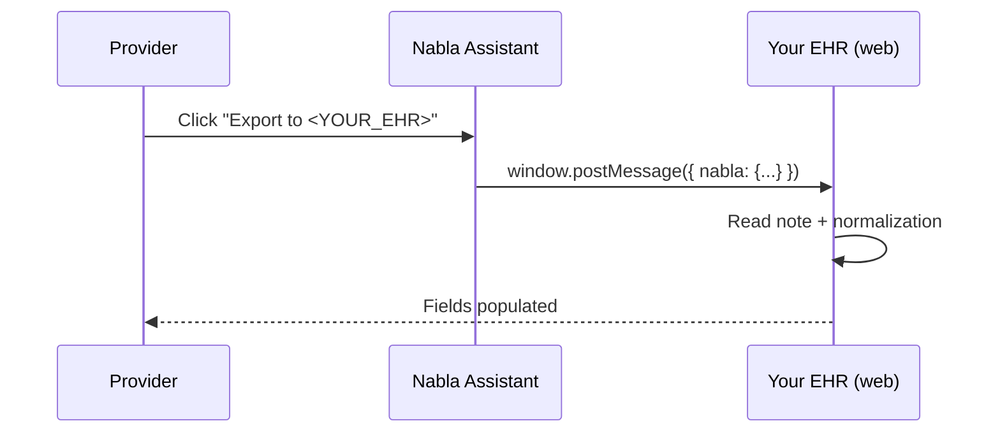
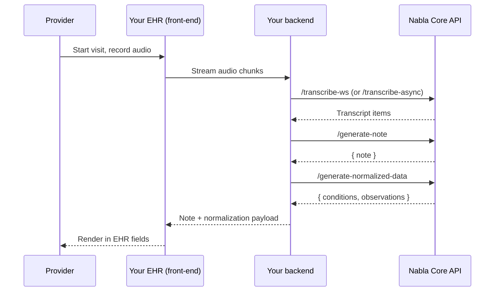

**What you'll build.** A working path from a Nabla-generated note into your EHR's UI — either via a browser-side bridge from the Nabla Assistant Chrome extension, or via the Core API directly from your backend.

**Prerequisites.**

- For the front-end path: a web-based EHR your clinicians use in Chrome.
- For the back-end path: a Server access token and the ability to render notes inside your EHR UI. See [Authentication](/core-api/authentication).

[Get in touch](https://www.nabla.com/copilot-contact/) if you'd like to discuss your use case with the Nabla team before picking a path.

## Pick a path

| Method | Best for | Pros | Cons |
|---|---|---|---|
| **Front-end integration** | Web-based EHRs where you can ship a small JS hook | Fastest to ship; leverages the existing Nabla UI; no Core API setup. | Limited to browser-based EHRs; less control over the data flow. |
| **Back-end integration** | All EHRs (including mobile) where you need deep UI control | Highly customizable; full access to all Core API capabilities (FHIR data, async, webhooks). | More work; you own the recording UX and the note rendering. |

## Front-end integration

Use the [Nabla Assistant Chrome extension](https://chrome.google.com/webstore/detail/nabla-copilot/gdhbaoemgglcgmkidhnhcellgnehaeol). On your EHR domain, request that Nabla replace the extension's "Copy" button with an "Export to `<YOUR_EHR>`" button. When the clinician clicks it, the extension dispatches a `window` event your EHR listens for.



### Wire the listener

```js
window.addEventListener("message", (event) => {
  if (!event.data?.nabla) return;
  const { note, normalization } = event.data.nabla;
  // Map note.sections → your EHR fields, e.g.:
  for (const section of note) {
    populateField(section.type, section.value);
  }
});
```

### Example message payload (trimmed)

```json
{
  "nabla": {
    "note": [
      { "type": "CHIEF_COMPLAINT", "title": "Chief complaint", "value": "- Persistent fatigue\n- Mild headaches on the right side" },
      { "type": "ASSESSMENT", "title": "Assessment", "value": "Possible sleep apnea or narcolepsy" },
      { "type": "PLAN", "title": "Plan", "value": "- Order a home sleep test\n- Discuss results in next consultation" }
    ],
    "normalization": {
      "assessment": [
        {
          "icd10Entry": { "code": "G47.30", "description": "Sleep apnea, unspecified" },
          "alternativeIcd10Entries": [
            { "code": "G47.33", "description": "Obstructive sleep apnea" }
          ],
          "uuid": "57141e7b-4a23-4cb1-883a-1b62c9823f69"
        }
      ]
    }
  }
}
```

The full normalization shape mirrors the Core API's [FHIR-normalized data response](/core-api/guides/extract-fhir-normalized-data).

## Back-end integration

You drive the recording UX yourself (microphone capture, upload), call the Core API server-side, and render the resulting note inside your existing EHR UI. This is the path for mobile EHRs and for any case where you need control over the data flow.



### Pieces to assemble

Each step has a dedicated guide:

1. **Capture audio** — use your own UI to record. For long files, you can also let the user upload an existing recording.
2. **Transcribe** — [Stream a live encounter](/core-api/guides/stream-a-live-encounter) for real-time, or [Transcribe a recorded encounter](/core-api/guides/transcribe-a-recorded-encounter) for files.
3. **Generate the note** — [Generate a clinical note](/core-api/guides/generate-a-clinical-note).
4. **Extract structured data** — [Extract FHIR-normalized data](/core-api/guides/extract-fhir-normalized-data) for ICD-10 / LOINC codes.
5. **Receive results asynchronously** — for high-throughput integrations, register [webhooks](/core-api/webhooks/overview) instead of polling.

### Production checklist

- Pin a specific API version. See [API versioning](/core-api/api-versioning/strategy).
- Implement signed webhook verification before going live. See [Webhooks setup](/core-api/webhooks/setup).
- Handle the error code `83023` for patient instructions with no actionable content. See [Error handling](/core-api/best-practices/error-handling).
- Plan for rate limits and add backoff. See [Rate limits](/core-api/best-practices/rate-limits).

## Next steps

<Columns cols={2}>
  <Card title="Generate a clinical note" icon="file-lines" href="/core-api/guides/generate-a-clinical-note">
    The first call most EHR integrations make after wiring auth.
  </Card>
  <Card title="Extract FHIR data" icon="hospital-user" href="/core-api/guides/extract-fhir-normalized-data">
    Push ICD-10 conditions and LOINC observations into your problem list.
  </Card>
</Columns>
