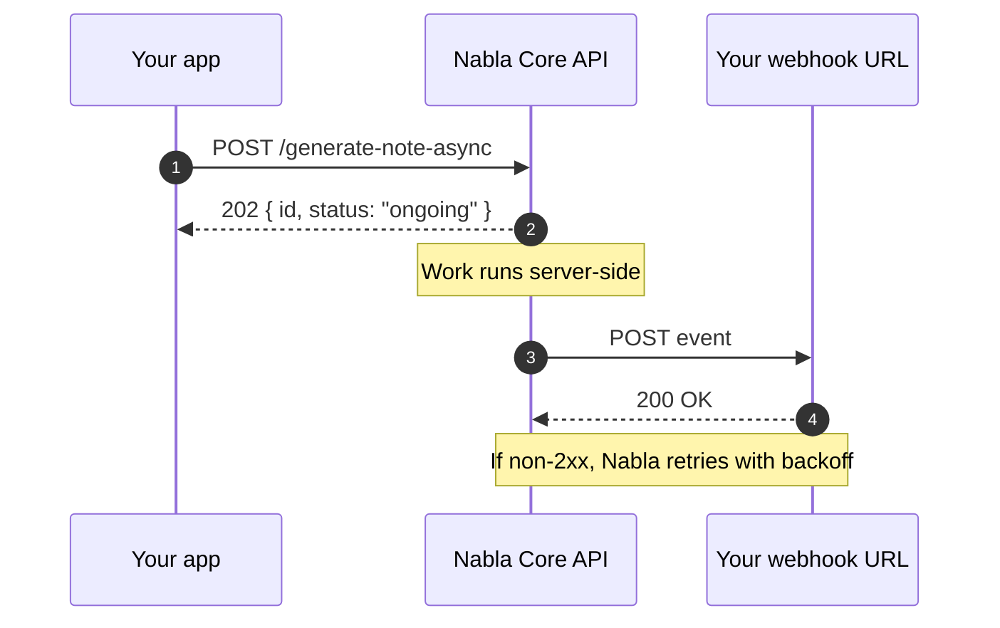

Webhooks let Nabla notify your servers when something happens — typically when a long-running task (async note generation, async dictation, async transcription) finishes. Instead of polling, you register a URL and Nabla `POST`s to it.

## Lifecycle



## Event types

Every event is delivered as a JSON `POST` body with a stable envelope (`id`, `created_at`, `type`, `data`). The `type` indicates which capability finished:

| Event type | Triggered by |
|---|---|
| `generate_note_async.succeeded` | A successful `POST /generate-note-async`. |
| `generate_note_async.failed` | A failed `POST /generate-note-async`. `data` contains the error code. |
| `transcribe_async.succeeded` / `transcribe_async.failed` | A finished async transcription. |
| `dictate_async.succeeded` / `dictate_async.failed` | A finished async dictation. |
| `generate_normalized_data_async.succeeded` / `.failed` | A finished async normalization (when enabled for your org). |

The set of enabled event types is configured per webhook in the [API Admin Console](https://pro.nabla.com/developers/webhooks). After enabling new async capabilities (e.g., async dictation), revisit that page to extend your existing webhook.

## Envelope shape

```json
{
  "id": "0cf0b04d-5bbe-47a9-9601-3dd037644f65",
  "created_at": "2024-07-15T12:47:34.380Z",
  "type": "generate_note_async.succeeded",
  "data": {
    "id": "fe309250-cf74-4f1e-8787-f8ad2826460d",
    "status": "succeeded",
    "payload": { "note": { ... }, "suggested_dot_phrases": [] }
  }
}
```

The `data` payload mirrors the response of the corresponding polling endpoint (e.g., `GET /generate-note-async/{id}`).

## What you need to ship

1. A publicly reachable HTTPS endpoint that accepts `POST` and returns `200` on success — see [Setup & signature verification](/core-api/webhooks/setup).
2. A signature verification step on every request — non-negotiable, since the URL is public.
3. Idempotency by `id` (the envelope's `id`) — Nabla may retry, so the same event can arrive more than once.
4. A retry strategy that returns 2xx on success and non-2xx on transient failures. See [Retries & idempotency](/core-api/webhooks/retries).

## Next steps

<Columns cols={2}>
  <Card title="Setup & signature verification" icon="shield-check" href="/core-api/webhooks/setup">
    Register a webhook, verify HMAC signatures, rotate secrets.
  </Card>
  <Card title="Testing webhooks locally" icon="flask" href="/core-api/webhooks/testing">
    Use ngrok or the Admin Console's replay to test before going live.
  </Card>
</Columns>
