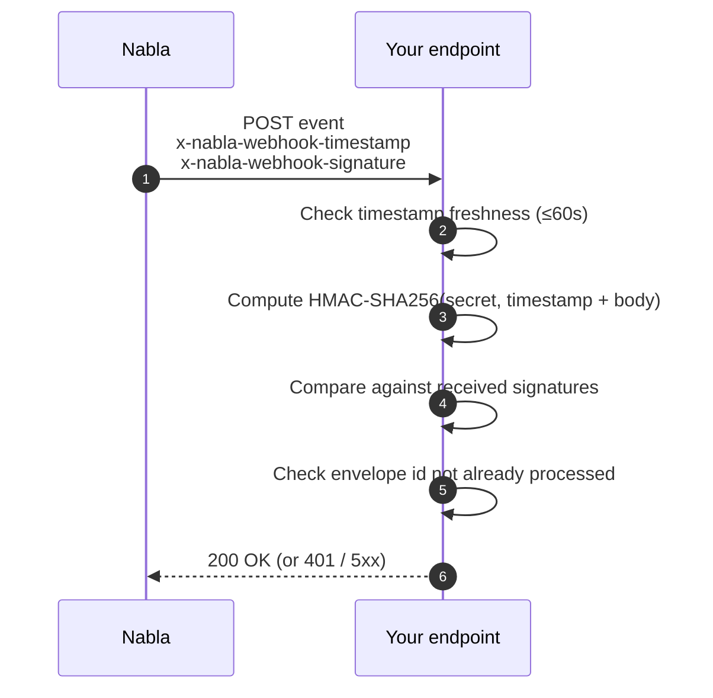

This guide assumes you've read the [Webhooks overview](/core-api/webhooks/overview). Here we'll register an endpoint and write the signature-verification code your endpoint needs to run on every incoming event.

## 1. Expose a public HTTPS endpoint

Your endpoint must:

- Accept `POST` over HTTPS (TLS is required — Nabla rejects plain HTTP).
- Return `200 OK` once the event is durably accepted on your side.
- Return a non-2xx status if you want Nabla to retry. See [Retries & idempotency](/core-api/webhooks/retries) for the backoff schedule.

For local development, expose your machine with a tunnel — see [Testing webhooks locally](/core-api/webhooks/testing).

## 2. Register the URL in the API Admin Console

Create a new webhook in [Webhooks](https://pro.nabla.com/developers/webhoooks) from the API Admin Console. Pick the event types you want delivered, then copy the **signature secret key** Nabla generates — you'll need it for verification.


## 3. Verify the signature on every request

All webhook deliveries include two headers:

- `x-nabla-webhook-timestamp` — the ISO 8601 timestamp Nabla sent the request.
- `x-nabla-webhook-signature` — one or more HMAC-SHA256 signatures (comma-separated during a key rotation window).

Each signature is `HMAC-SHA256(secret, timestamp + raw_body)`. Your endpoint must:

1. Extract both headers.
2. Reject the request if the timestamp is older than 60 seconds.
3. Compute `HMAC-SHA256(secret, timestamp + raw_body)` using the secret you copied from the console.
4. Compare it against the received signatures (constant-time compare). Reject with 401 if none match.
5. Reject the request if the envelope `id` has already been processed (idempotency — Nabla may retry).



<Tabs>
<Tab title="Node (Express)">

```js
const bodyParser = require("body-parser");
const crypto = require("crypto");
const express = require("express");

const app = express();
const WEBHOOK_SECRET = process.env.NABLA_WEBHOOK_SECRET;
const seenIds = new Set(); // replace with a durable store in production

app.use(
  bodyParser.json({
    verify(req, res, buf) {
      const timestamp = req.headers["x-nabla-webhook-timestamp"];
      const received = (req.headers["x-nabla-webhook-signature"] || "").split(",");

      if (!timestamp || Date.now() - Date.parse(timestamp) > 60_000) {
        throw new Error("Timestamp too old");
      }

      const computed = crypto
        .createHmac("sha256", WEBHOOK_SECRET)
        .update(timestamp + buf.toString())
        .digest("hex");

      const match = received.some((sig) =>
        crypto.timingSafeEqual(Buffer.from(sig.trim()), Buffer.from(computed))
      );
      if (!match) throw new Error("Signature mismatch");
    },
  })
);

app.post("/webhooks/nabla", (req, res) => {
  const { id } = req.body;
  if (seenIds.has(id)) return res.status(200).end(); // already processed
  seenIds.add(id);
  // ... handle the event ...
  res.status(200).end();
});
```

</Tab>
<Tab title="Python (Flask)">

```python
import hmac
import hashlib
import os
import time
from datetime import datetime, timezone
from flask import Flask, request, abort

app = Flask(__name__)
WEBHOOK_SECRET = os.environ["NABLA_WEBHOOK_SECRET"].encode()
seen_ids = set()  # replace with durable storage in production

@app.post("/webhooks/nabla")
def receive():
    timestamp = request.headers.get("x-nabla-webhook-timestamp", "")
    received = request.headers.get("x-nabla-webhook-signature", "").split(",")
    raw_body = request.get_data()

    try:
        sent_at = datetime.fromisoformat(timestamp.replace("Z", "+00:00"))
    except ValueError:
        abort(401)
    if (datetime.now(timezone.utc) - sent_at).total_seconds() > 60:
        abort(401)

    computed = hmac.new(
        WEBHOOK_SECRET, (timestamp + raw_body.decode()).encode(), hashlib.sha256
    ).hexdigest()

    if not any(hmac.compare_digest(sig.strip(), computed) for sig in received):
        abort(401)

    payload = request.get_json()
    if payload["id"] in seen_ids:
        return "", 200
    seen_ids.add(payload["id"])
    # ... handle the event ...
    return "", 200
```

</Tab>
</Tabs>

For more details on HMAC-SHA256 see [RFC-2104](https://datatracker.ietf.org/doc/html/rfc2104) and [RFC-4231](https://datatracker.ietf.org/doc/html/rfc4231).

## 4. Rotate the signature secret regularly

In the API Admin Console, press **Rotate**. Nabla generates a new secret and continues signing with the previous one for a short window so your old code keeps working. Your endpoint must accept either signature during that window (the verification snippets above already do — they iterate over comma-separated signatures).

When you've deployed the new secret, immediately invalidate the old one if you suspect compromise; otherwise let it expire automatically.

## Next steps

<Columns cols={2}>
  <Card title="Retries & idempotency" icon="rotate-right" href="/core-api/webhooks/retries">
    The retry schedule and how to make your handler safe under retry.
  </Card>
  <Card title="Testing webhooks locally" icon="flask" href="/core-api/webhooks/testing">
    ngrok, request bins, and Admin Console replay.
  </Card>
</Columns>
